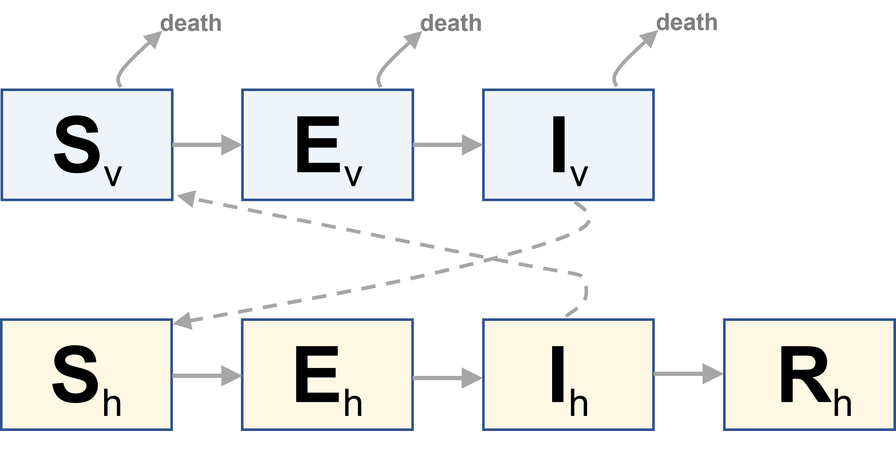

# SEIR-SEI  
Draft version of SEIR-SEI model for *Vesicular stomatitis* transmission between equid hosts and *Culicoides* spp vectors.  Model includes Susceptible-Exposed-Infected-Removed compartments for equids and Susceptible-Exposed-Infected compartments for vectors.  Vectors populations have a defined mortality rates.   

This shiny app is currently live, click here to view: [SEIR-SEI Model for VSV](https://spatial-dynamics.shinyapps.io/shiny/)  

## Model Diagram 

